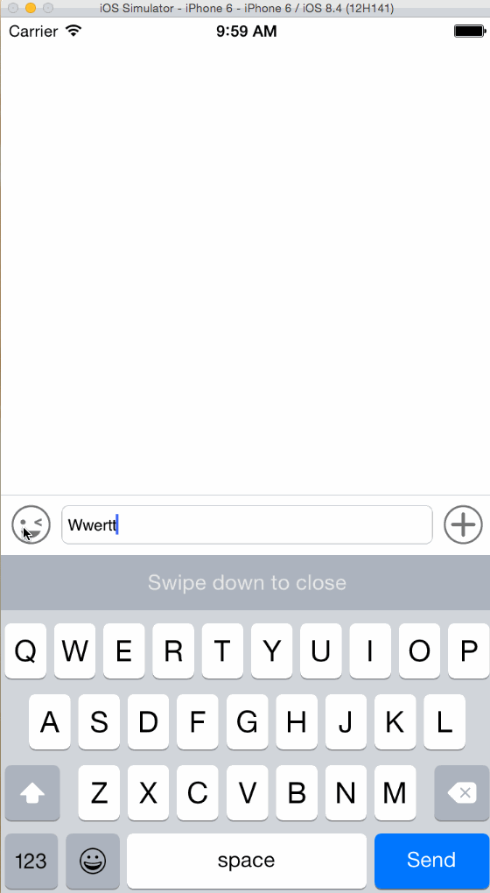

# BCKeyboard
这是一个聊天键盘，使用方法
不好意思因为缺少project.pbxproj导致项目打不开，可能是冲突现在正在解决....
我上传了这个文件，右键点击BCKeyBoardDemo.xcodeproj显示包内容，将project.pbxproj文件复制到包内容中
应该就可以打开项目了..

BCKeyBoard *bc = [[BCKeyBoard alloc] initWithFrame:CGRectMake(0, [UIScreen mainScreen].bounds.size.height - 46, [UIScreen mainScreen].bounds.size.width,46)];  

bc.delegate = self;  

bc.imageArray = @[];图片数组  

bc.placeholder = @"";占位文字  

bc.placeholderColor = ;占位文字颜色  

bc.backgroundColor = [UIColor clearColor];  

bc.currentCtr = self;当前控制器

[self.view addSubview:bc];

###GitHub仓库中的图片

